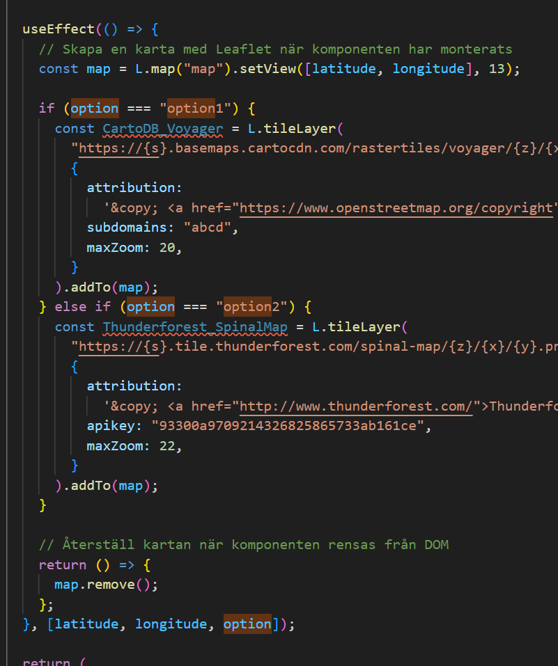
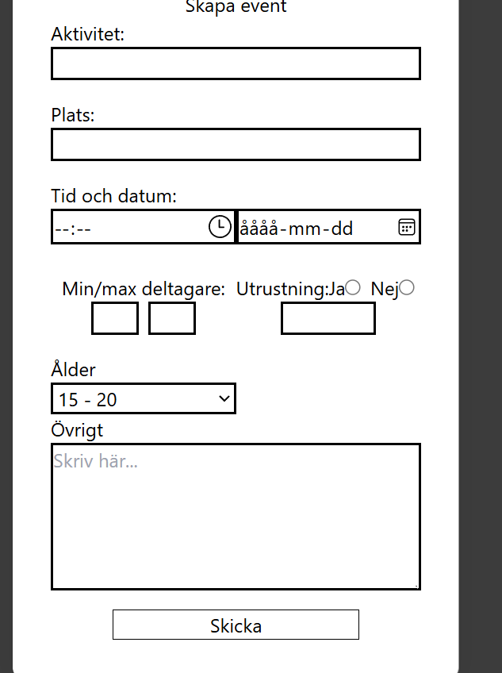
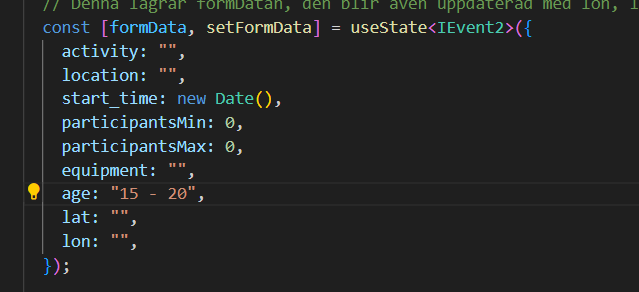
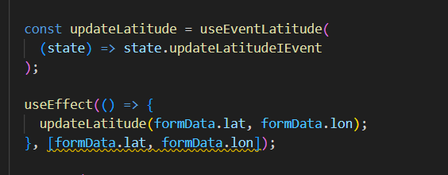

SearchBar

I denna fil finns ett form som har en text input för att kunna söka på platser och två inputs för att kunna välja två olika stilar på kartan.

För att inte göra ett Api call vid varje bokstav som skrivs utan när ordet är klart och användaren trycker på submit så gjorde jag en ny useState som tar emot plats

För att endast uppdatera denna när användaren klickar på knappen bredvid input så kopplade jag en funktion handleSubmit med en onClick.

För att kunna skriva in ett sökord och se uppdateringar på ordet man skriver in i text inputen finns en useState

Inputen har en onchange som är kopllad till handlechange denna funktionen uppdaterar en useState som heter setSearchWord som sätter in varjekonstav som skrivs i textrutan.

Funktionen handleSubmit har en funktion som heter `event.preventDefault();` som förhindrar att sidan laddas om sedan uppdaterar den en annan useState som heter place med searchWord.

När place är satt kommer den att trigga useEffect där denna variabel finns som trigger som kommer att trigga funktionen `fetchData()` som finns i den som i sin tur kommer sätta in place i anropet och därmed hämta data i forma av json. Som till sist kommer att uppdatera useState LocationData med den hämtade jsonDatan.

`updateUserLocation` variabel bundit funktionen för att kunna uppdatera store med värdena latitude och longitude som har hämtats från anropet. UseEffecten används för att trigga denna funktion och skicka dessa variabler till storen.

För att kunna byta mellan två plika kartor finns två radio inputs med två olika value som har onChange som är kopllat till `handleChangeRadio`

Denna funktion fungerar precis likadant som för sökordet och kommer i sin tur uppdatera en useState som heter SelectedValue

Denna usestate har default value på option1 så att kartan alltid visar de valet från början.

Variabeln updateOption är sedan kopplad till useMapsFormData funktionen som i sin tur triggar state.updateOption funktionen i storen. Denna variabel blir en funktion eller knuten till en funktion som sedan används i useEffekten för att sätta in och uppdatera selectedValue i storen.

useMapsFormData

Detta är en store som satts upp för att kunna skicka variabler mellan olika komponenter. userLocation och option är vaiablerna som kommer bli uppdaterade med värden i storen. updateUserLocation är funktionen i storen som används för att uppdatera variablerna med de nya värdenna för lat och lon. updateOpten är funktionen i storen aom används för att uppdatera variabeln option med nya värden.

Interfacen som används i storen är till för att deffinera typerna av värden som finns i storen.

Maps2

När denna component skapas så körs denna useEffekt som triggar funktionen getUserLocation och sätter användarens värden i useState Latitude och Longitude

För att uppdatera med en ny plats som användare söker efter så tar vi in latitude och longitude från storen genom att hämta variablerna.

useEffekten har userLocation som dependensie så när den uppdateras med nua värden från storen så kommer denna att triggas och den kommer då att uppdatera useState Latitude och Longitude med nya värden.

Option hämtas också från store och läggs in i variabeln option.

Variablerna från usestate för lon. lat kommer sedan uppdatera esuEffekten för kartan. Kartan har Latitude, Longitude och option som dependesie och detta betyder att när något av dessa värden ändras så kommer denna att uppdateras. Lat och lon skulle då sättas in för arr uppdatera kartan och denna vy och option finns i if för att se om värdet är option 1 eller 2 som då bestämmer vilken kart vy som kommer visas

EventForm:

Detta form tar in data om event och skall skicka över lon, lat till maps för att kunna trigga en funktion som lägger till en marker på användarens event destination.

Jag tog in interfacet IEvent från shared mappen som ligger bredvid backend och frontend mapparna. Denna shared mapp finns för att kunna dela interface mellan backend och frontend. Jag använde detta interface på useStaten och sedan deffinerade jag vad variablerna har för default värden.

Jag upprättade sedan en fetch funktion som skulle kunna skicka ordet som skrivs in på plats till API:t för att kunna få kordinater. För att bara skicka ett API call var jag tvungen att göra yttliggare en useState som inte uppdateras på onchange utan på sumbit. setFormdata uppdateras på onchanger varjegång användaren gör någonting med formet. När användaren känner sig klar och trycker på submit så kommer onsubmit att köras och i den funktionen finns preventDefault() som hindrar så att inte sidan laddas om och setPlace() som kommer att hämta location från formData och sätta den i SetPlace.

Min fetchData har jag satt i en useEffekt som har place som trigger och kommer när användare trycker på sumbit och place uppdateras att triggas och då göra ett api call.

I denna useEffekt har jag seddan tagit jsondatan med lon, lat och satt in dessa i formData för att sammla all info på en och samma plats.

Jag upprättade sedan en Zustandstore som heter useEventLatitude för att kunna skicka dessa kordinater till maps två för att sedan kunna göra en funktion där som triggas när dessa uppdateras och lägger till en marker. I EventForm så så hämtar jag först storen och binder den till updateLatitude variabeln sedan så har jag en useEffect under som har forData.lat och formData.lon som beroende och uppdaterar storen om de blir triggade.

