SearchBar

I denna fil finns ett form som har en text input för att kunna söka på platser och två inputs för att kunna välja två olika stilar på kartan.

För att inte göra ett Api call vid varje bokstav som skrivs utan när ordet är klart och användaren trycker på submit så gjorde jag en ny useState som tar emot plats

För att endast uppdatera denna när användaren klickar på knappen bredvid input så kopplade jag en funktion handleSubmit med en onClick.

För att kunna skriva in ett sökord och se uppdateringar på ordet man skriver in i text inputen finns en useState

Inputen har en onchange som är kopllad till handlechange denna funktionen uppdaterar en useState som heter setSearchWord som sätter in varjekonstav som skrivs i textrutan.

Funktionen handleSubmit har en funktion som heter `event.preventDefault();` som förhindrar att sidan laddas om sedan uppdaterar den en annan useState som heter place med searchWord.

När place är satt kommer den att trigga useEffect där denna variabel finns som trigger som kommer att trigga funktionen `fetchData()` som finns i den som i sin tur kommer sätta in place i anropet och därmed hämta data i forma av json. Som till sist kommer att uppdatera useState LocationData med den hämtade jsonDatan.

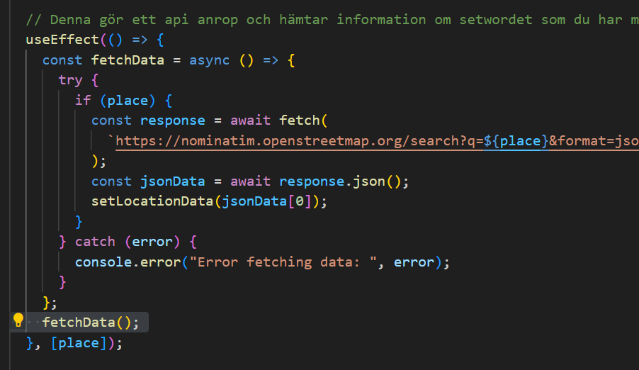

`updateUserLocation` variabel bundit funktionen för att kunna uppdatera store med värdena latitude och longitude som har hämtats från anropet. UseEffecten används för att trigga denna funktion och skicka dessa variabler till storen.

För att kunna byta mellan två plika kartor finns två radio inputs med två olika value som har onChange som är kopllat till `handleChangeRadio`

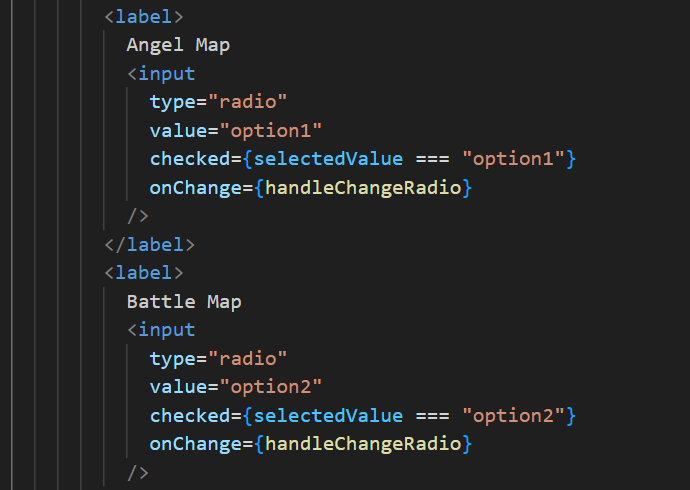

Denna funktion fungerar precis likadant som för sökordet och kommer i sin tur uppdatera en useState som heter SelectedValue

Denna usestate har default value på option1 så att kartan alltid visar de valet från början.

Variabeln updateOption är sedan kopplad till useMapsFormData funktionen som i sin tur triggar state.updateOption funktionen i storen. Denna variabel blir en funktion eller knuten till en funktion som sedan används i useEffekten för att sätta in och uppdatera selectedValue i storen.

useMapsFormData

Detta är en store som satts upp för att kunna skicka variabler mellan olika komponenter. userLocation och option är vaiablerna som kommer bli uppdaterade med värden i storen. updateUserLocation är funktionen i storen som används för att uppdatera variablerna med de nya värdenna för lat och lon. updateOpten är funktionen i storen som används för att uppdatera variabeln option med nya värden. Denna stor behöv som nämt för att kunna dela lon och lat mellan searchbaren och map2 för att kunna söka på ett område och att kartan ska kunna visa det området.

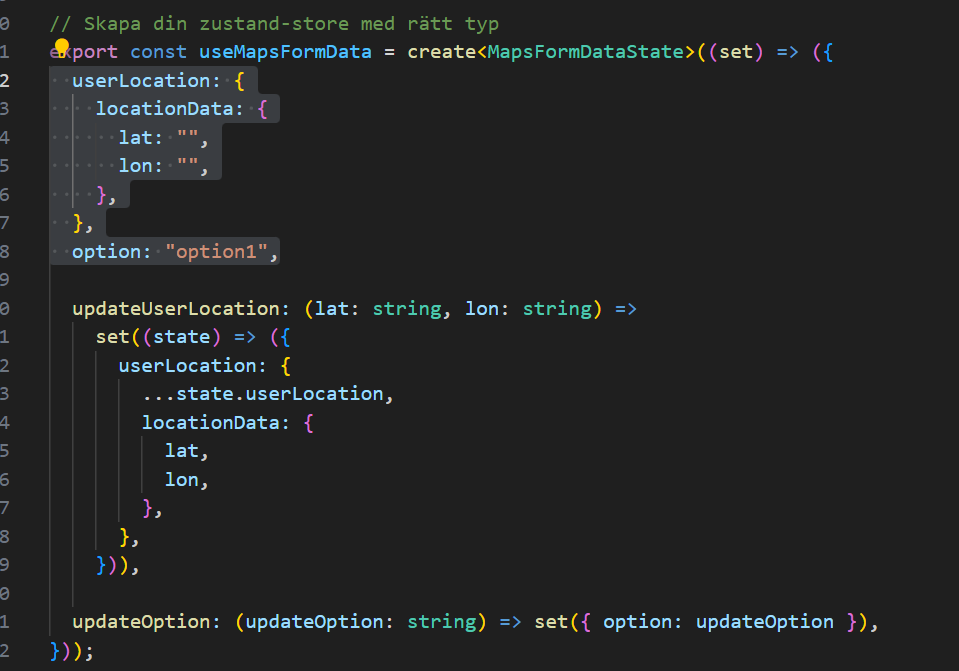

Interfacen som används i storen är till för att deffinera typerna av värden som finns i storen.

Maps2

När denna component skapas så körs denna useEffekt som triggar funktionen getUserLocation och sätter användarens värden i useState Latitude och Longitude användaren kommer också kunna se event som är skapade och markers på kartan. Detta för att denna komponent gör en fetch till databasen när den skapas och då går en loop igenom alla event som finns och lägger ut dom på kartan.

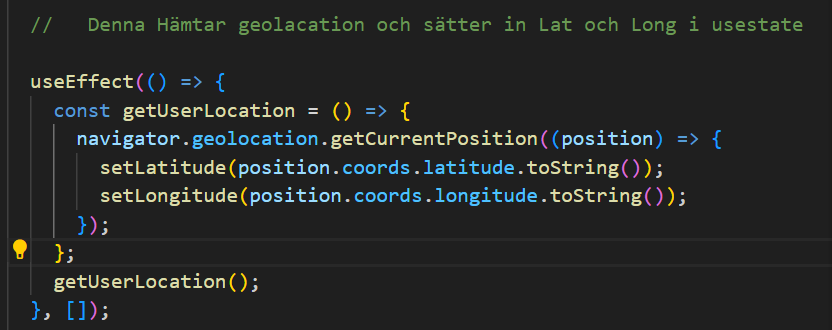

För att uppdatera med en ny plats som användare söker efter så tar vi in latitude och longitude från storen genom att hämta variablerna.

useEffekten har userLocation som dependensie så när den uppdateras med nya värden från storen så kommer denna att triggas och den kommer då att uppdatera useState Latitude och Longitude med nya värden.

Option hämtas också från store och läggs in i variabeln option.

Variablerna från usestate för lon. lat kommer sedan uppdatera esuEffekten för kartan. Kartan har Latitude, Longitude och option som dependesie och detta betyder att när något av dessa värden ändras så kommer denna att uppdateras. Lat och lon skulle då sättas in för arr uppdatera kartan och denna vy och option finns i if för att se om värdet är option 1 eller 2 som då bestämmer vilken kart vy som kommer visas

För att adda Marker när en användare lägger till ett nytt event så gjorde jag en useEffekt som triggas varjegång komponenten skapas denna useEffekt har en fetch i sig som gör en get request till databasen för att hämta alla event.

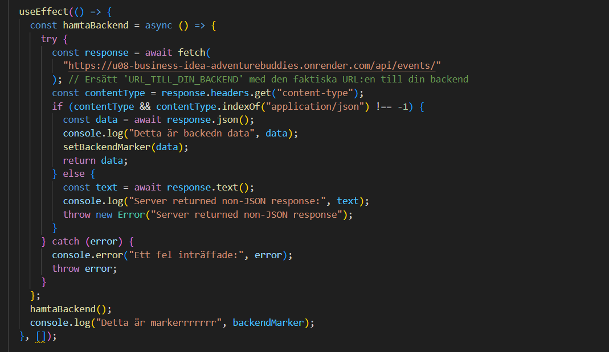

I hamtaBackend så har jag en setBackendMarker som uppdaterar detta useState med all data från backend. För att sedan få ut en marker på kartan för varje event som har skapats så gjorde jag sedan en forEach på backendMarker för att sätta ut en pin för varje destination jag lade även till `binPopup()` för att lägga till aktivitet vid varje pin.

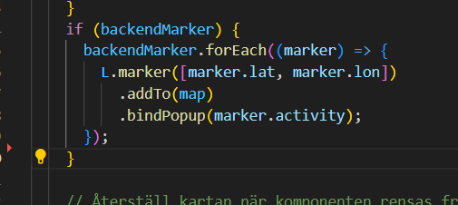

Föratt dölja API KEY i frontend så skapade jag en .env fil där jag satte in nyckeln och sedan hämtade jag nyckeln därifrån med hjälp av import för att sedan sätta in den i url:en.

EventForm:

Detta form tar in data om event och skall skicka över lon, lat till maps för att kunna trigga en funktion som lägger till en marker på användarens event destination.

Till detta form hade jag först ett interface men upptäckte att man intebehöer ha ett interface om typeerna tolkas korrekt. Detta sätt att typbestämma utan att använda interface heter inlined state initialization med detta menas att typescript aoutomatiskt försöker bestämma typerna utifrån de initiala värdenna som sätts.

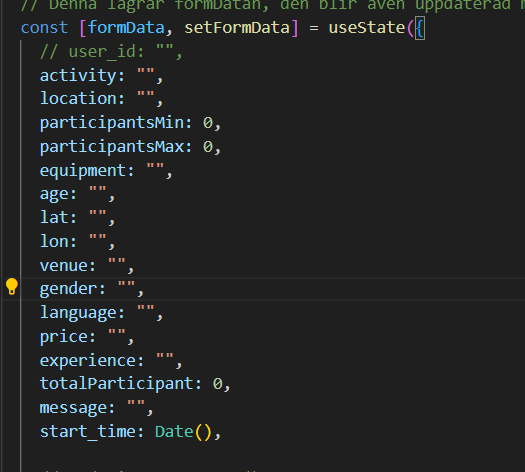

Jag upprättade sedan en fetch funktion som skulle kunna skicka ordet som skrivs in på plats till API:t för att kunna få kordinater. För att bara skicka ett API call var jag tvungen att göra yttliggare en useState som inte uppdateras på onchange utan på sumbit. setFormdata uppdateras på onchanger varjegång användaren gör någonting med formet. När användaren känner sig klar och trycker på submit så kommer onsubmit att köras och i den funktionen finns preventDefault() som hindrar så att inte sidan laddas om och setPlace() som kommer att hämta location från formData och sätta den i SetPlace. Efter data är satt så omdirrigeras användaren till en annan sida med hjälp av navigate().

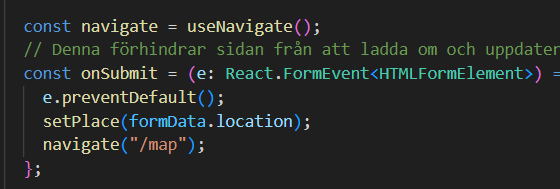

Min fetchData har jag satt i en useEffekt som har place som trigger och kommer när användare trycker på sumbit och place uppdateras att triggas och då göra ett api call.

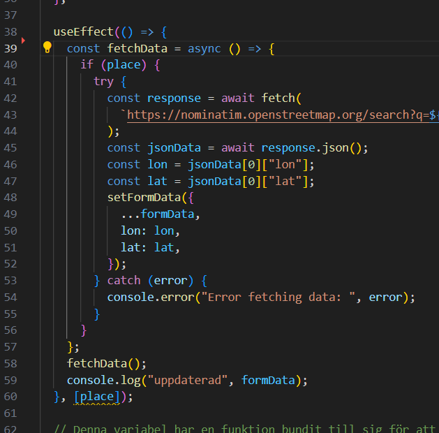

I denna useEffekt har jag seddan tagit jsondatan med lon, lat och satt in dessa i formData för att sammla all info på en och samma plats.

För att säkerställa att place är satt innan ett försök att skicka formet tillbackend görs så var jag tvungen att lägga till ett nytt usestate för att ha koll på när formet är redo för att skickas

if sattsen som finns nedan kommer att köras om formIfylltOchKlart är false då kommer den sätta denna usestate till true och sätta fkordinaterna i setPlace()

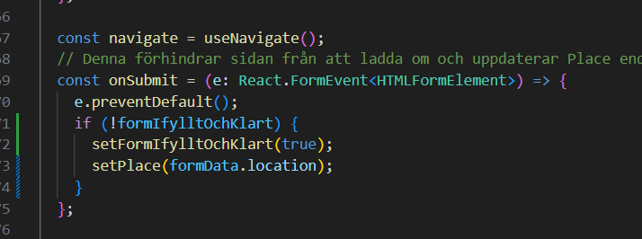

efter detta så kommer sendDataBackend att köras på grund av att formData.lat och formdata.lon finns i dependesi arrayen på useEffekten. i denna finns en navigate som kommer köras och finally kommer att ändra formIfylltOchKlart till false.

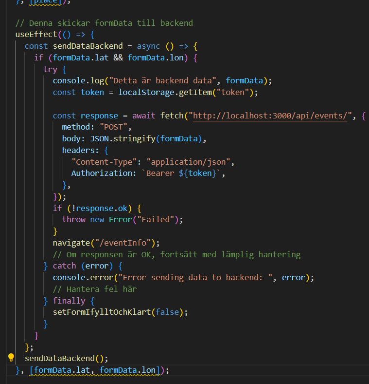

---

<u>LoginPage:</u>

Denna komponent hanterar inloggningen genom att samla användarens inmatning --> skicka den till en server --> och om inloggningen är lyckad, navigeras användaren till sin profil.

Detta uppnås via olika funktioner som hanterar olika tillstånd. Nedan kommer en övergriplig beskrivning av koden:

I koden importeras `useState` som är en React Hook för att hantera komponentes tillstånd. Biblioteket `React` används för att bygga användar gränssnitt.
`Link`, `useNavigate` och `useOutletContext` är funktioner från `react-router-dom` som hanterar navigation och kontext inom en router.

I interface `ContextType` beskrivs även vilken kontexttyp som finns för `onLogin` funktionen som tar in `email`, `userId` och `token`.

I funktionen `LoginForm` möter vi `checked` och `setChecked` som hanterar tillståndet för checkbox.

`navigate` navigerar till en annan sida.

`onLogin` är en funktion som är hämtar från kontexten att hantera inloggning.

`formData` och `setFormData` hanterar tillståndet för formulärdatan från användaren (email och lösenord).

I `LogoinForm` komponenten har vi även funktioner som
`handleInputChange` som uppdaterar tillståndet för `formData` när användaren skriver in email eller lösenord.
`handleChange` finns för att kunna uppdatera tillståndet i checkbox för att komma ihåg användaren i formuläret.

Funktionen `handleSubmit` hanterar formulärets inmatning genom att skicka inloggningsuppgifterna till servern via en POST-förfrågan och behandlar svaren för att logga in samt navigera användaren till sin profil.

I returen framgår komponentens UI, det vill säga User Interface, vilket är själva formuläret som användaren ser framför sig. Den är för oss utvecklare, kopplad till en databas som tar in informationen från användaren.

---

<u>RegisterForm: </u>

Som föregående formulär tar även denna in olika data från användaren för registrering.

I komponenten `RegisterPage` har vi även här en `formData` och `setFormData` som hanterar tillståndet för all data som innehåller användaren registreringsuppgifter.

Funktionerna som framgår här är bland annat `handleInputChange` (uppdaterar `formData` när använder ger oss ett värde i textfälten), `handleSelectChange` (uppdaterar `formData` när användaren väljer ett visst värde i vår dropdown-meny).

Funktionen som hanterar formurlärets insändning av data är `handleSubmit` som också skickar allt, likt `LoginForm`, uppgifterna till servern via POST-förfrågan och behandlar svaren för att indikera om registreringen lyckades eller inte.

I vår retur, som blir användarens UI, har vi ett formulär som tar in data som `namn`, `användarnamn`, `email`, `lösenord`, `födelsedatum`, `kön` och `telefonnummer`. Knappen till formuläret triggar igång funktionen `handleSubmit`.

När detta är klart har vi en fullt registrerad användare i vår databas som är redo att logga in och skapa sina egna event samt få tillgång till sin profilsida.

---

<u>AuthContext: </u>

AuthContext är en React-kontext som hanterar autentiseringslogiken för en applikation. 
Här är en kort förklaring av vad den gör:

1. Kontextdefinition: AuthContext skapas med createContext och används för att lagra autentiseringsstatus och relaterade data som e-post, användar-ID och token.

2. `AuthProvider`: Detta är en komponent som förser sina underkomponenter med autentiseringsdata och funktioner för att logga in och logga ut.
    * Statehantering: `useState` används för att hantera autentiseringstillstånd (isAuthenticated), e-post (email), användar-ID (userId) och token (token).
    * Lokal lagring: Vid första renderingen hämtar `useEffect` eventuellt sparad autentiseringsdata från `localStorage` och uppdaterar state om användaren är inloggad.
    * Login-funktion: Uppdaterar state och `localStorage` med användarens e-post, ID och token när användaren loggar in.
    * Logout-funktion: Rensar state och `localStorage` när användaren loggar ut.
3. `useAuth`: En anpassad `hook` som gör det enklare för komponenter att använda autentiseringskontexten. Den kastar ett fel om den används utanför `AuthProvider`.

Sammanfattningsvis hanterar AuthContext autentiseringsstatus och användaruppgifter samt erbjuder inloggnings- och utloggningsfunktionalitet, vilket gör att resten av applikationen kan få tillgång till denna information på ett enkelt och konsekvent sätt.

**Vart använder vi AuthContext då?**

* Main.tsx:
    * Med hjälp av AuthContext har vi omslutit vår RouterProvider med `AuthProvider` och lagt till ProtectedRouteProps för att säkerställa att användare måste vara inloggade för att kunna se alla sidor.

* App.tsx
    * I App.tsx tar vi hand om login och logout och om användarens autentiserings status

* LoginPage.tsx
    * Här lägger vi till användarens email, id och token när vi loggar in, som sparas och delas till de sidor där man behöver vara inloggad (sköts i App.tsx som vidare är kopplat till AuthContext.tsx). 

* Navbar.tsx
    * Vi hämtar AuthContext här för att kolla om man är inloggade eller inte, är vi inloggade visas vårat namn istället för logga in samt att vi får en dropdown meny med olika länkar i. Vi hanterar även logga ut (logout) här.

* EventListItem.tsx
    * här använder vi oss av isAuthenticated för att kunna visa en del data för personer som inte är inloggade, och mer detaljer om du är inloggad

---

<u>Navbar</u>

I navbaren har vi länkar (*Link*) till respective sida, stylingen ser olika ut beroende om du är på mobil eller desktop. Login knappen blir en dropdown när du väl loggat in, och den bytter då till ditt användarnamn (username). I dropdown menyn använder jag mig av *EventListener* för mustryck för att den ska stängas när du tryckt på en länk eller trycker utanför menyn. Har även en *useEffect* för att den ska stängas när du har loggat ut, så när du loggar in nästa gång så är den stängd.

Mobil:

Desktop:

---

<u>User Update (Komponent)</u>

Vi använder oss av en *UserUpdateProps*, där vi använder oss utav `userData` som innehåller informationen vi vill uppdatera och `setUserData` funktion för att uppdatera datan i parent-komponenten (i detta fall UserProfilePage).

`useEffect` och `useState` använder vi oss av för att hantera komponentens tillstånd och livscykel.

Till exempel använder vi oss av `useEffect` för att uppdatera `formData` när `userData` ändras.

`handleInputChange` uppdaterar `formData` baserat på var användaren matar in i input fälten, här inkluderar vi även filuppladning med hjälp av `multer` i våran backend. Så att filerna kan sparas i databasen (Mongodb).

`handleUpdate` skickar en PUT-förfrågan till våran backend för att uppdatera användarens data.
`handldeRemoveAccount` skickar en DELETE-förfrågan för att radera en användares konto. I `handldeRemoveAccount` använder vi oss av en `window.confirm` för att få upp en ruta för att dubbelkolla om användaren verkligen vill radera sitt konto. 

Komponenterna `Button` och `Input` använder vi oss av för användargränssnittets knappar och inmatningsfält. Så att alla knappar och fält ser lika dana ut på alla sidor.

`useNavigate` från `react-router-dom` använder vi oss av för att kunna navigeringa mellan olika sidor.

---

<u>UserProfilePage</u>

På den här sidan hämtar och visar vi användarens profilinformation. 

Vi använder oss av `userData` för att kunna visa och uppdatera användarens information.

Även här använder vi oss av `useEffect` och `useState` för att hantera komponentens tillstånd och livscykel.

`useEffect` körs när komponenten mountas (renderas för första gången). Den innehåller en asynkron funktion `fetchUserData` som gör följande:
1. Hämtar användarens-ID och token från `localStorage`.
2. Skickar en GET-förfrågan till API för att hämta användardata.
3. Om förfrågan lyckas, uppdaterar `userData` med den hämtade datan.
4. Om förfrågan misslyckas, loggar det ett felmeddelande.

I `returnen` hämtar vi även data från komponenterna **UserUpdate**, **UserEvents** och **FriendsList**.

---

